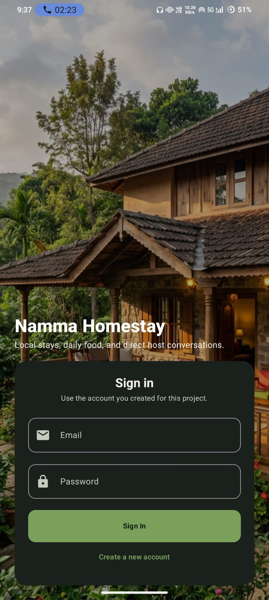
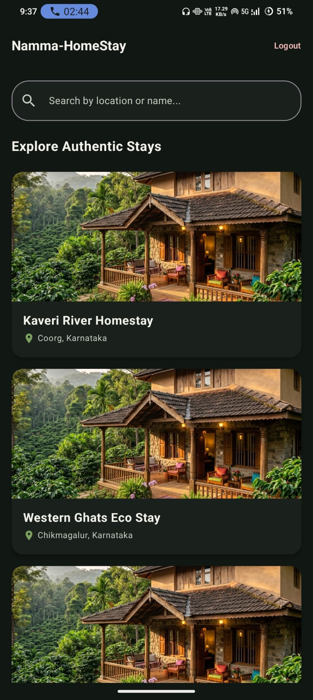
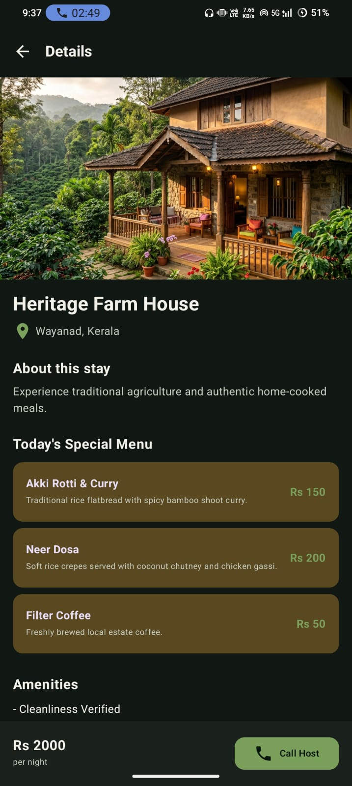
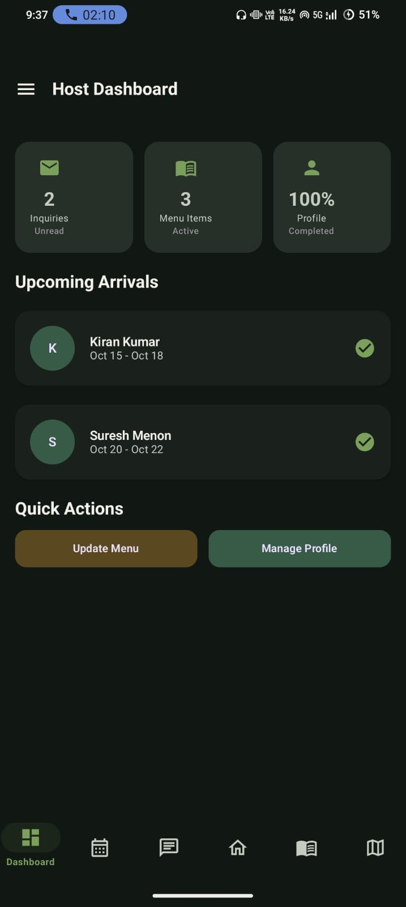
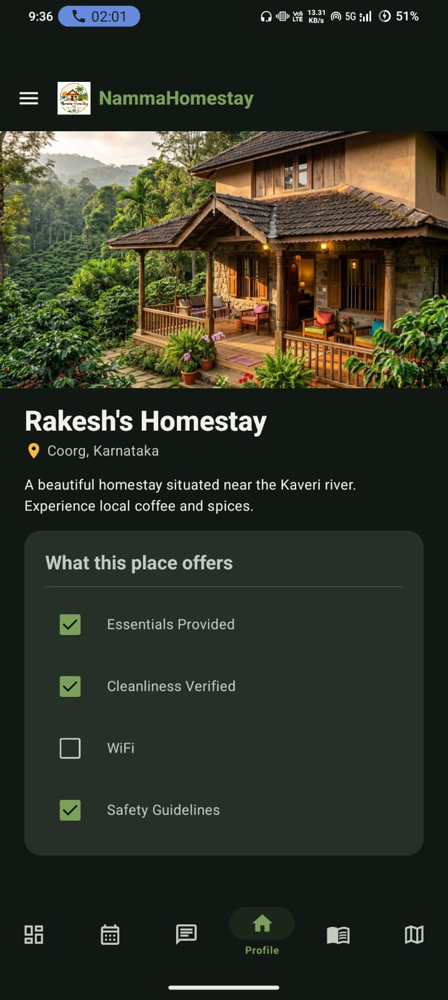
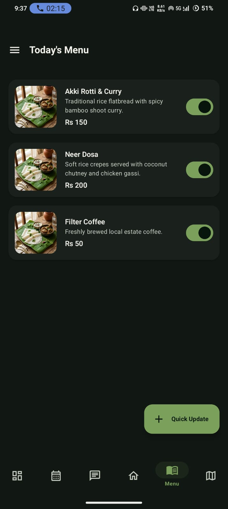
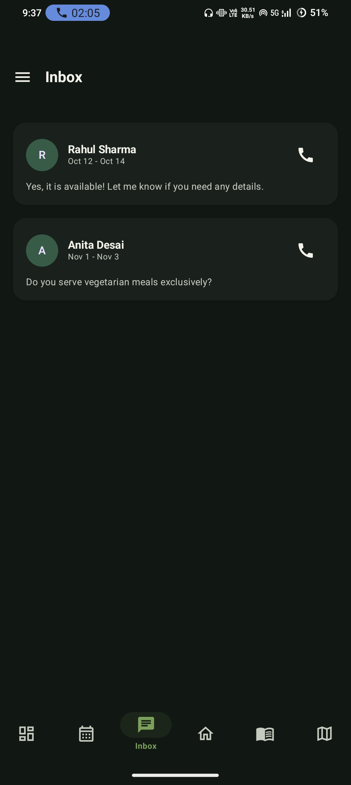
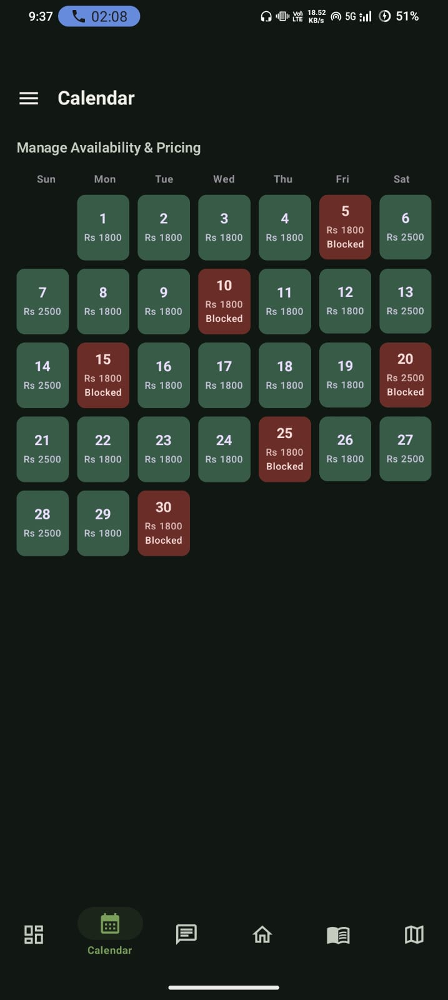
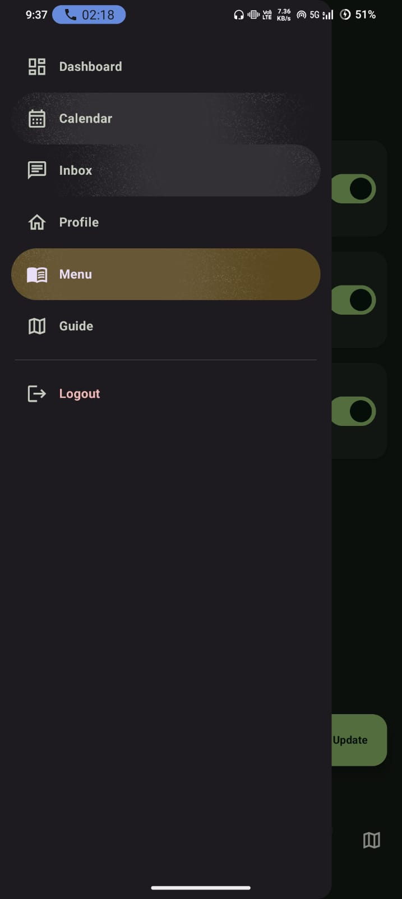

# Namma Homestay

Android app for small rural homestay hosts and travelers. Namma Homestay helps local hosts manage their homestay profile, daily food menu, inquiries, calendar availability, and nearby guide spots, while travelers can discover authentic stays and directly contact hosts.

## Problem Statement

Many houses in rural and coastal areas have extra rooms and serve excellent local food, but the owners may not be comfortable using large hotel booking platforms. They miss visitors from eco-tourism, agro-tourism, and local experience travel. Namma Homestay provides a simple mobile-first host portal and traveler discovery experience for this gap.

## Project Highlights

- Complete Android project with Kotlin and Jetpack Compose.
- Firebase Authentication for email/password login and signup.
- Firestore-backed user roles and project data.
- Separate Host and Traveler experiences.
- Daily menu update flow designed to be quick for non-technical hosts.
- Inquiry chat screen with call button support.
- Local guide feature for waterfalls, viewpoints, farms, and hidden spots.
- Calendar availability and pricing management.
- Warm, rural hospitality-inspired UI theme.
- Firebase Storage intentionally avoided to keep the project free-friendly.

## Screenshots / App Visuals

The repository includes real application screenshots captured from the Android app. These screens show both Host and Traveler workflows.

### Authentication and Traveler Screens

| Login | Traveler Home | Traveler Detail |
|---|---|---|
|  |  |  |

### Host Screens

| Host Dashboard | Host Profile | Daily Menu |
|---|---|---|
|  |  |  |

| Inquiry Inbox | Calendar | Navigation Drawer |
|---|---|---|
|  |  |  |

## Features

### Authentication

- Sign up with full name, email, password, and role.
- Login with Firebase Email/Password Authentication.
- Role-based routing:
  - Host users open the Host Dashboard.
  - Traveler users open the Traveler Home screen.
- Logout support.

### Host Features

- Dashboard with inquiries, active menu items, and profile completion.
- Homestay profile screen with:
  - Name
  - Location
  - Description
  - Room photos
  - Living area photos
  - Verification checklist
- Daily menu management:
  - Add dish name, description, price, and optional image URI.
  - Toggle dish availability.
- Inquiry box:
  - View traveler messages.
  - Reply in chat.
  - Open phone dialer from call button.
- Calendar:
  - View daily availability.
  - Toggle dates as available or blocked.
  - Show price per day.
- Local guide:
  - Add and view nearby attractions or secret spots.

### Traveler Features

- Search homestays by name or location.
- View homestay details.
- See price per night.
- View local menu preview.
- View verified amenities.
- Call the host directly.

## Tech Stack

| Layer | Technology |
|---|---|
| Language | Kotlin |
| UI | Jetpack Compose |
| Design System | Material 3 |
| Architecture | ViewModel + Repository pattern |
| Authentication | Firebase Authentication |
| Database | Cloud Firestore |
| Image Loading | Coil |
| Build System | Gradle Kotlin DSL |
| IDE | Android Studio |
| Version Control | Git + GitHub |

## Applications / Tools Required

- Android Studio
- Android Emulator or physical Android phone
- JDK bundled with Android Studio
- Firebase Console account
- Git
- GitHub repository

## Firebase Services Used

This project uses:

- Firebase Authentication
- Cloud Firestore

This project does not use:

- Firebase Storage
- Firebase paid image hosting
- Payment gateway services

## Firebase Collections

| Collection | Purpose |
|---|---|
| `users` | Stores user profile and Host/Traveler role |
| `profiles` | Stores homestay profile data |
| `menu` | Stores daily food menu items |
| `inquiries` | Stores traveler inquiry messages |
| `guides` | Stores local guide spots |
| `bookings` | Stores demo upcoming booking data |
| `calendar` | Stores availability and pricing |

## Project Structure

```text
NammaHomestay/
├── app/
│   ├── build.gradle.kts
│   ├── proguard-rules.pro
│   └── src/
│       ├── androidTest/
│       ├── test/
│       └── main/
│           ├── AndroidManifest.xml
│           ├── java/com/example/namma_homestay/
│           │   ├── MainActivity.kt
│           │   ├── Navigation.kt
│           │   ├── Models.kt
│           │   ├── ViewModels.kt
│           │   ├── FirebaseRepository.kt
│           │   ├── screens/
│           │   │   ├── DashboardScreen.kt
│           │   │   ├── HomeProfileScreen.kt
│           │   │   ├── DailyMenuScreen.kt
│           │   │   ├── InquiryBoxScreen.kt
│           │   │   ├── CalendarScreen.kt
│           │   │   ├── LocalGuideScreen.kt
│           │   │   ├── auth/
│           │   │   │   ├── LoginScreen.kt
│           │   │   │   └── SignUpScreen.kt
│           │   │   └── user/
│           │   │       ├── TravelerHomeScreen.kt
│           │   │       └── HomestayDetailScreen.kt
│           │   └── ui/theme/
│           │       ├── Color.kt
│           │       ├── Theme.kt
│           │       └── Type.kt
│           └── res/
│               ├── drawable/
│               ├── mipmap-*/
│               ├── values/
│               └── xml/
├── gradle/
├── build.gradle.kts
├── settings.gradle.kts
├── gradle.properties
├── gradlew
├── gradlew.bat
├── README.md
├── PRD.md
└── FIREBASE_SETUP.md
```

## Setup Instructions

### 1. Clone the Repository

```bash
git clone https://github.com/Rakesh171717/namma-homestay.git
cd namma-homestay
```

### 2. Open in Android Studio

1. Open Android Studio.
2. Select **Open**.
3. Choose the cloned `namma-homestay` folder.
4. Wait for Gradle sync to complete.

### 3. Add Firebase Config

The file `app/google-services.json` is required locally but intentionally not committed to GitHub.

Place your Firebase config file here:

```text
app/google-services.json
```

Firebase setup details are documented in:

```text
FIREBASE_SETUP.md
```

### 4. Enable Firebase Services

In Firebase Console:

1. Enable **Authentication > Email/Password**.
2. Create **Cloud Firestore Database**.
3. Use authenticated read/write rules for demo testing.

### 5. Build the App

```bash
./gradlew assembleDebug
```

On Windows:

```powershell
.\gradlew.bat assembleDebug
```

### 6. Run Unit Tests

```bash
./gradlew testDebugUnitTest
```

On Windows:

```powershell
.\gradlew.bat testDebugUnitTest
```

### 7. Run the App

1. Start an Android emulator or connect an Android phone.
2. Click **Run** in Android Studio.
3. Create a Host or Traveler account.

## Build Verification

The project has been verified with:

```powershell
.\gradlew.bat assembleDebug
.\gradlew.bat testDebugUnitTest
```

## Important Repository Notes

The following files are intentionally ignored:

- `app/google-services.json`
- `local.properties`
- `app/build/`
- Gradle build output folders
- generated APK files

This keeps private machine settings, Firebase config, and generated files out of GitHub.

## Documentation Files

| File | Purpose |
|---|---|
| `README.md` | Main repository documentation |
| `PRD.md` | Product Requirements Document |
| `FIREBASE_SETUP.md` | Firebase setup instructions |

## Evaluation Checklist

- [x] Public GitHub repository
- [x] Source code included
- [x] README included
- [x] Setup and run commands documented
- [x] Dependency/config files included
- [x] Clear project folder structure
- [x] Screenshots/app visuals included
- [x] Firebase services documented
- [x] Build commands documented
- [x] Generated folders ignored
- [x] Project-specific implementation included

## Future Improvements

- Add traveler inquiry creation from the detail screen.
- Add host profile editing form for phone, name, location, and description.
- Add map-based local guide.
- Add notification support for new inquiries.
- Add stronger production Firestore security rules.
- Add optional AI-assisted menu/profile text suggestions.

## Author

**Rakesh**  
GitHub: [Rakesh171717](https://github.com/Rakesh171717)

## Repository

[https://github.com/Rakesh171717/namma-homestay](https://github.com/Rakesh171717/namma-homestay)
